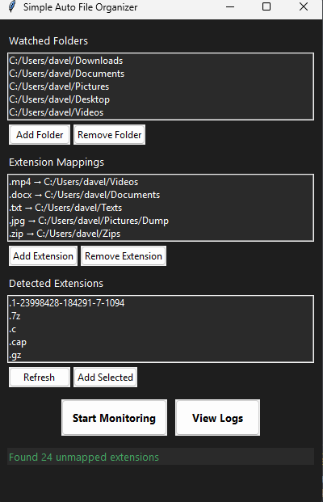

# Orderly-Files

A Python-based file organization tool with a modern GUI interface that automatically monitors and organizes files based on their extensions.

<div align="center">
  
</div>

## Features

- 🖥️ Modern dark-themed GUI interface
- 📁 Automatic file monitoring and organization
- 🔄 Real-time file movement based on extension rules
- 📝 Comprehensive logging system
- ⚙️ Configurable watch directories and file extensions
- 🛡️ System file protection (ignores system extensions)

## Requirements

- Python 3.x
- tkinter (usually comes with Python)
- Standard Python libraries

## Installation

1. Clone this repository:

```bash
git clone https://github.com/yourusername/Orderly-Files.git
cd Orderly-Files
```

2. Set up a virtual environment (recommended):

```bash
# Create a virtual environment
python -m venv venv

# Activate the virtual environment
# On Windows:
venv\Scripts\activate
# On macOS/Linux:
source venv/bin/activate
```

3. Install dependencies:

```bash
pip install -r requirements.txt
```

4. Run the application:

```bash
python src/auto_move_files_tkinter.py
```

## Usage

1. Launch the application
2. Add watch directories where you want to monitor files
3. Configure file extensions and their target directories
4. Click "Start Monitoring" to begin automatic file organization
5. The application will automatically move files to their designated folders based on their extensions

## Project Structure

- `src/auto_move_files_tkinter.py`: Main GUI application
- `src/auto_move_files.py`: Core file organization logic
- `requirements.txt`: Project dependencies
- `logs/`: Directory containing application log files

## Logging

The application maintains detailed logs in the `logs` directory within the project folder. Logs are created daily and can be viewed directly from the application interface. Each log file is named with the format `auto_filer_YYYYMMDD.log`.

## Contributing

Feel free to submit issues and enhancement requests!

## License

This project is open source and available under the MIT License.
